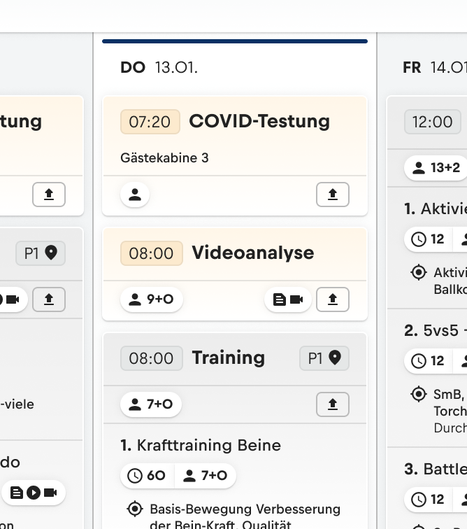
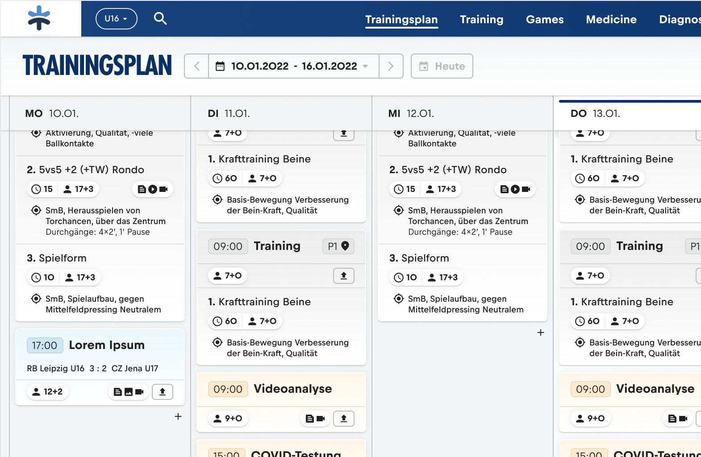
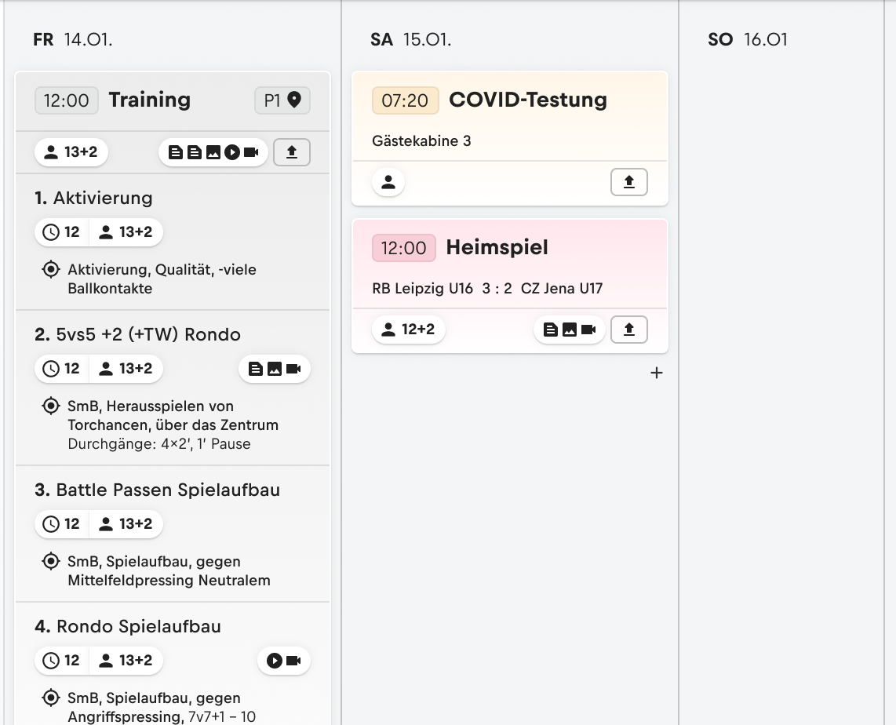
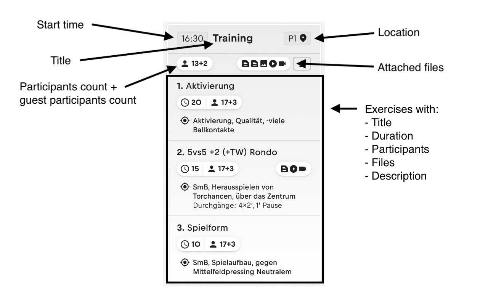

# ML TRIAL

## Assignment

Implement the Training plan view ([figma link](https://www.figma.com/file/za84bydGnD1C3AJGQBfJwc/Trial-Task---Trainingplan?node-id=0%3A1)).
Only the first three screens (the first row) are part of the assignment. You can ignore the rest. The time spent on the assignment should not exceed 8 hours.
It's fine if you cannot finish the whole assignment in the given time. Code quality is more important than quantity.

If any part of the assignment is unclear or ambiguous, make the best possible decision in your opinion. Please also elaborate on your decision either via code comment or in your response.
If critical information is missing (so critical that you cannot work on the assignment), please contact us.
If you have trouble with the provided setup, feel free to use your own. **Usage of tailwind, redux-toolkit, redux-saga will be appreciated.**

### Task description

The Training plan shows events for one week (Monday - Sunday) in a time table like view, ordered by time.
The current day should be highlighted with a blue indicator at the top and a different background.


The header row (featuring weekdays and dates) stick to the top when scrolling down.


Day columns without events should be narrower than the ones with events.


The event cards feature different backgrounds, depending on the type of the event (find color codes here app/modules/event/results/types.js:11).
An event card is constructed as following:


If an event has no title provided, a fallback title should be shown corresponding the the event type:
- away_game => Auswärtsspiel
- home_game => Heimspiel
- other => Sonstige
- profile_training => Profiltraining
- tournament => Turnier
- training => Training
- video_session => Videoanalyse

The page header should feature a date picker. The component is provided (app/components/molecules/DateCyclePicker/index.jsx). Selecting a different time frame should update the events accordingly.
It should initially show the current week. Clicking the button ("Heute" meaning "today") beside the date picker should bring you back to the current week. If you are already showing the current week, the button should be disabled.

A mock for event data is provided, with a default store module setup. Components interact with the store via hooks.
You can enhance the mocked API call with "startDate" and "endDate" parameters to get events for this particular time frame (app/modules/event/results/saga.js:26).
Store setups can differ a lot. If you have trouble with ours (maybe you've never used redux-toolkit or redux-saga) you can stick with the provided default module and leave out the date filtering.

You can start coding in app/components/pages/TrainingPlan/index.jsx and have a look at your progress under http://localhost:3000/training-plan

If you are super fast and want to earn some extra points (completely optional!!!) you can:
- write test for your code with the provided jest setup
- think of a nice loading state for the Training plan

Have fun coding :)!

## Install
```
  npm install
```

## Build
This project uses [vitejs](https://vitejs.dev/) as bundler, which uses [rollup](https://rollupjs.org/) for production builds.

Production builds are built to the `dist/` folder.
Polyfills and legacy chunks are generated using the [vitejs/legacy plugin](https://github.com/vitejs/vite/tree/main/packages/plugin-legacy).

Please review the `vite.config.js` file for more information about bundling.
```
  npm build
  npm run preview (to preview the dist/ folder on a local server)
```

### Environment specific configs
Environment specific configs can be applied to a build using the `APP_ENV` environment variable, e.g.:
```
  APP_ENV=development npm build
```
The `APP_ENV` translates to a corresponding kebab-cased file in the `app/config` folder.
The available environments are: `development`, `TBD`.

If no `APP_ENV` is provided the `app/config/default.js` config is used.

### i18n
Translations are done through [formatjs](https://formatjs.io/).
To extract all messages into a single json file run:
```
  npm run extract-messages
```
The messages are extracted and compiled to `app/translations/en.json` and `app/translations/extracted/en.json`.
The `extracted` file contains meta information if available.

To support other languages provide a corresponding translation json file in `app/translations` e.g. `app/translations/de.json`.

## Develop
[vitejs](https://vitejs.dev/) uses [esbuild](https://esbuild.github.io/) as development bundler.

To start the development bundler run
```
  npm start
```

### Code Style
The code-style is enforced through eslint and prettier, and checked on commit. There are various IDE/text editor integrations available, to fix all major eslint or prettier issues on file save.

### Anatomy
```
|- components
|- contexts (shared contexts)
|- hooks (shared hooks)
|- injectors (reducer and saga injectors, separated by feature)
|- modules (slices and sagas, separated by feature)
|- services (api configuration, requests, storage access, etc.)
|- translations (translated json files)
|- utils
```

#### Components
This project follows the [atomic design](https://bradfrost.com/blog/post/atomic-web-design/) structure to organize the components. An eslint rule is present to prevent non atomic-design conform imports.

Component related stories and tests should be nested within the component's folder.
```
|- components
  |- atoms (basic building blocks)
    |- Button
      |- index.jsx
      |- stories/index.stories.js
      |- tests/index.test.jsx
  |- molecules (groups of atoms bonded together)
  |- organisms (groups of molecules and atoms to form complexer interfaces)
  |- pages
  |- templates
```

#### Contexts & Hooks
All shared and reusable contexts and hooks should reside in this directory.
Feature/component specific hooks and contexts should stay in the corresponding component directory.

#### Injectors and Modules
The [redux-toolkit](https://redux-toolkit.js.org/) is used for global state management.
[redux-saga](https://redux-saga.js.org/) is used to handle async side effects.


The created reducers and sagas are lazy injected for better code splitting and smaller chunk sizes.
The redux specific injectors and modules (slices and sagas) should be separated by feature:
```
|- injectors
  |- user
    |- ResultsInjector.jsx
    |- CreateInjector.jsx
|- modules
  |- user
    |- results (list of users)
      |- index.js (imports all slice and saga exports and re-exports them to provide a single module entry point)
      |- slice.js (contains a redux-toolkit slice, as well as the corresponding actions and selectors)
      |- saga.js (contains the async side effects which are required by the module)
      |- tests
        |- saga.test.js
        |- slice.test.js
    |- create (create a single user)
```

### Story Book
A story book is provided to illustrate all reusable `atoms`, `molecules` and `templates`.

To view the storybook run:
```
  npm run storybook
  npm run storybook-static (for a static build)
```
To create new stories, create a sub-folder called `stories/` in the corresponding components folder and create files as `<filename>.stories.js`

### Styling
This project uses [tailwindcss](https://tailwindcss.com/) for styling. When developing, you should not use specific colors if possible. Since this project should be themeable, the color generic classes `primary`, `secondary`, etc. should be preferred. Please take a look at the `tailwind.config.js` to get an overview of the available generic color definitions.

This project should also support **dark mode** and **reduced-motion** preferences.

#### Desktop styles on mobile
As some pages should feature their desktop experience on mobile (i.e. featuring no mobile optimization), the custom postcss plugin **postcss-enforce-media-queries** was added. It's looking for `@media` rules with `min-width` params and duplicates their child declarations with `.enforce-desktop` prefixed.
```
  @media (min-width: 1280px) {
    .foo {
      background: red;
    }
  }

  .enforce-desktop .foo {
    background: red;
  }
```

### Icons
Material Icons in their rounded variant are used. Icon components should be created on demand. The `create-icon` npm script is provided to ease the process. Icon name should be in snake_case (i.e. all lower case with _ between words).
```
  npm run create-icon <name>
```

### Testing
Testing is done using [jest](https://jestjs.io/) and the [react testing library](https://testing-library.com/docs/react-testing-library).

### Release
Releases should be done using the release npm task and with semantic versioning. It uses [release-it](https://github.com/release-it/release-it) to increase the version number (major, minor or patch) and to generate/update the `CHANGELOG.md` file. The necessary conventional-changelog commit-style is enforced with [commitlint](https://github.com/conventional-changelog/commitlint) and [husky](https://github.com/typicode/husky).
```
  npm run release -- major|minor|patch (--dry-run if not sure)
```
